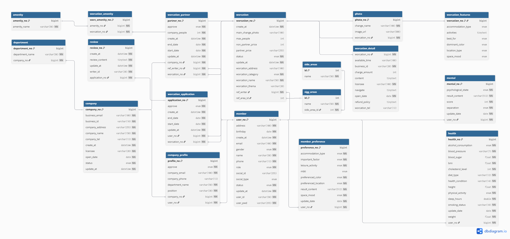

# Mineping

React와 Spring Boot를 활용한
직장인들에게 심리기반 맞춤 워케이션 장소를 추천해주는 웹 사이트입니다

# 프로젝트 소개

---
- 개발 기간: 2025-06-04 ~ 2025-07-18
- 서비스 링크: [https://www.mineping.store](https://www.mineping.store)
- 팀원: 최예찬, 최성진, 윤택봉, 이상준

## 기술 스택

---
`Back-end`

## 아키텍쳐

---

## 사용 라이브러리 및 API

---
- 사업자 진위확인 API
- Spring AI
- JWT
- OAuth2
- Lombok
- MapStruct
- Spring Security
- JDBC

# 메인기능

---
- Spring AI 기능
  - 심리 테스트 검사
  - 하루 식단 추천
  - 사이트에 등록되어있는 워케이션 장소 중에서 사용자 맞춤 추천
- 직원의 워케이션 근무 현황 관리
- 워케이션 예약 및 예약 과정에서의 동시성 관리
- 한 달간의 예약 수 기반 인기 장소 선별

## 부가 기능

---
- JWT, Gmail SMTP, 사업자등록번호 진위확인 API를 활용한 회원가입 및 로그인 구현
- 회원가입 시 회사 회원은 회사를 등록하고 직원은 등록되어 있는 회사를 선택
- 회원 유형에 따라 사이트 이용 권한을 제한하는 로직 구현
- 직원의 심리 상태가 위급한 직원 확인
- 워케이션 업체 등록
- 워케이션 장소 검색

## ERD

# 기본 설계

---
### Rest API
   * HTTP 프로토콜 기반으로 자원을 표현한 상태를 전송하는 방식, React와의 의존성을 분리 시킴
### MVC 패턴
   * DTO(Model) : 데이터를 요청을 받고 응답을 반환하는 순수 데이터 전송 방식
   * Controller, Service, Repository(Controller) : 비즈니스 로직을 구현하는 부분, 영속성 데이터 혹은 API와 통신
   * React(View) : DTO의 응답을 React Axios가 받아서 데이터가 동적 페이지를 구현하는 방식
### JPA(ORM) [Hibernate]
   * 데이터베이스 조작 기술로 객체 방식으로 데이터를 다룰 수 있는 JPA기술 사용
   * 대표적인 JPA 프레임워크로 Hibernate 채택
   * entity로 데이터 객체 생성 및 관계 설정, Persistence Context로 영속성 관리

### Spring Security
   * Spring 기반 보단 프레임워크
   * 다양한 보안 기술을 구성

# 확장 설계

---
### RestControllerAdvice
* 전역 설정을 할 수 있는 컨트롤러 보조 클래스
* Exception Handler를 사용해 예외처리를 전역 설정

### Bean Validation
* 비즈니스 로직을 실행하기 전에 데이터 형식이 맞지 않으면 바로 예외 처리할 수 있는 기능 구현

### Concurrency Control
* @Lock를 통해 비관적 락을 구현하여 동시성 제어
* Race Condition를 방지

### JWT
* JWT와 같은 토큰 기반 로그인 방식을 사용
* 톰캣의 Session를 사용하지 않음으로써 서버가 로그인을 관리하지 않아 
 서버가 가벼워짐

### OAuth 2.0
* 웹사이트에서 많이 쓰이는 Google Login을 채택 
* 복잡한 인증 로직 없이 환경변수 설정만으로 간편하게 Google OAuth 적용 가능

### Redis
* 이메일 인증번호 같이 일회성 데이터를 처리하는데 사용
* 간단한 로직만으로 ConcurrentHashMap으로 구현하지 않아도 동시성 제어하면서 데이터 유효 시간 설정 가능
* 이메일 인증을 구현하기 위해 인증번호를 DB에 저장할 필요가 없어짐

### Method Security
* Spring Security의 기능
* Filter와 interceptor 접근 권한을 제어하는 복잡한 로직 불필요
* @PreAuthorize("hasRole(...)")와 같은 어노테이션만으로 접근 권한에 따라 실행할 수 있는 비즈니스 로직 제어 가능

# 기술적 고민들

---

## 1. 국세청 API(진위여부 확인)

- 문제 상황 및 원인  
  사업자 등록정보 API를 백엔드에서 호출하는 과정에서 인증키 오류가 발생했습니다.  
  Postman으로 테스트할 때는 오류가 없었지만, 실제 서버에서 호출할 경우 인증키 관련 오류가 반복적으로 발생했습니다.
    

- 원인  
  여러 차례 원인을 분석하고, 현업에 종사하는 전문가에게도 문의해 보았지만 정확한 원인을 파악하지 못했습니다.
    

- 해결방법  
  백엔드에서 호출 시 오류가 계속 발생하는 반면, 프론트엔드에서는 오류 없이 동작하는 것을 확인했습니다.  
  이에 따라 API 호출을 프론트엔드에서 처리하도록 변경하여 문제를 우회적으로 해결했습니다.

## 2. Open AI API 사용

- 문제 상황 및 원인  
  Spring AI를 사용하지 않고, 무료 OpenAI API를 이용해 텍스트(Chat) 생성은 성공했지만
  이미지(Image) 생성 요청 시 "더 구체적으로 작성하라"는 오류가 반복적으로 발생했습니다.
    

- 원인  
  요청을 보다 구체적으로 보내 보았지만, 여전히 동일한 오류가 지속되었고 명확한 원인을 파악하기 어려웠습니다.
    

- 해결방법  
  다음 두 가지 방향을 고려했습니다:
  1. 다른 이미지 생성 API 사용  
     → 여러 무료 API를 테스트했으나, 대부분 호출 횟수 제한이 존재하고 일정 이상 사용 시 유료로 전환되었습니다.  
       또한, 응답 속도가 느리거나 불안정한 경우가 많아 실사용에는 어려움이 있었습니다.

  2. Spring AI 기반 OpenAI 정식 API 사용  
     → 요금이 발생하더라도 안정적인 품질과 빠른 응답 속도를 보장할 수 있으며,
     Spring Boot와의 연동 또한 간편하여 유지보수 측면에서도 유리했습니다.  
     특히, Spring AI는 프롬프트 구성, 요청/응답 처리, 모델 설정 등을 객체 지향적으로 다룰 수 있어 코드의 재사용성과 확장성이 좋다.
       
     결국 2번(Spring AI 기반 정식 OpenAI API 사용) 을 선택하여 이미지 생성 기능의 신뢰성과 사용자 경험을 보장하기로 결정했습니다.
     
